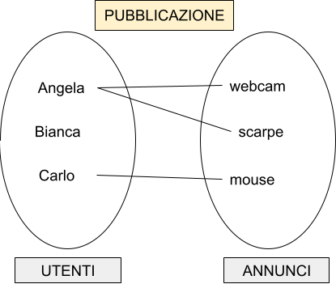

# Introduzione alla Progettazione Concettuale
## Approccio pratico: studiamo un'applicazione web

---

# Obiettivo

Vogliamo imparare a progettare un'applicazione web.
Lo faremo studiando un applicazione web esistente... magari ci scappa anche uno spuntino!

*L'obiettivo finale è decidere da quali tabelle sarà composto il database che memorizza i dati di un'applicazione web.*

---

# Progettazione

Il termine progettazione indica un procedimento che ci consente di partire da un'idea per giungere alla sua realizzazione:

---

# Applicazione web a tre livelli

Questa è la struttura tipica di un'applicazione web:

---

# Livello presentazione

I dati sono presentati all'utente attraverso **viste**, costituite da una o più pagine web con cui l'utente può interagire.

Possiamo realizzare queste viste con i tipici strumenti per lo sviluppo web lato client: 
- HTML: struttura della pagina
- CSS: aspetto della pagina
- JS: interattività, validazione dati lato client
- React, Vue, Angular: framework lato client

---

# Livello dati

I dati visualizzati nell'applicazione sono gestiti da un DBMS. Possono essere letti e modificati inviando al DBMS richieste codificate usando il linguaggio **SQL**.

DBMS = Data Base Management System.

Noi useremo il DBMS MariaDB, derivato dal più famoso MySQL.

---

# Livello applicazione

Costituisce un ponte tra i dati e la loro presentazione. si occupa di ricevere e validare i dati inseriti dall'utente, di interrogare o aggiornare il database.

Gestisce aspetti quali autenticazione e autorizzazione.

I programmi di questo livello sono realizzati usando un linguaggio di sviluppo web **server side**, nel nostro caso PHP. Combinando i dati utente e quelli del database, producono pagine web, che vengono poi inviate all'utente che he ha fatto richiesta.

---

# Studiamo un'applicazione web esistente

Proviamo ora ad utilizzare una nota applicazione web e a capire la sua struttura.

Visitiamo [questo sito](https://www.justeat.it), proviamo ad iscriverci e ad ordinare qualcosa.

Questa fase della lezione deve essere **attiva**. Mentre utilizziamo il sito:

- annotate le **azioni** che stiamo eseguendo. Elencate i passaggi che abbiamo svolto per eseguire ogni azione.
- identificate quali **viste** (pagine web) stiamo usando per compiere le varie azioni. Raccogliete, di ogni vista, le seguenti informazioni:

---

- l'indirizzo (URL), visibile nella **barra degli indirizzi** del **browser**
- quali dati vengono richiesti all'utente
- quali dati dell'applicazione vengono visualizzati
- individuate gli **oggetti** (**fatti**, **persone**, **cose**) visibili in ogni pagina.
- provate ad elencare le caratteristiche comuni di ogni oggetto

---

# Resoconto

Elenchiamo insieme:

- Quali azioni abbiamo eseguito?
- Quali pagine abbiamo visitato?
- Quali oggetti avete individuato?
- Quali proprietà avete annotato, per ogni oggetto?

---

# Entità

D'ora in avanti, useremo il termine **Entità** per indicare gli oggetti di un'applicazione web.
Ogni entità ha un **nome** univoco. Non possono esistere due entità con lo stesso nome.
Ogni entità è caratterizzata da uno o più **attributi**.

---

# Attributi

Un attributo può essere:

- semplice: contiene un solo possibile valore
- composto: è formato da più informazioni.

Individuiamo attributi semplici e composti, tra quelli fin qui elencati.

---

# Chiavi

Alcuni attributi hanno una particolare caratteristica. Contengono un valore differente per ogni entità. Due entità distinte hanno obbligatoriamente un valore diverso per questo attributo. 

Questi attributi si chiamano **chiavi**. Proviamo a individuare quali attributi possono essere chiavi, tra quelli sin qui elencati.

---

# Attributi speciali...

Alcuni attributi hanno una caratteristica speciale: abbiamo dato loro il nome di un'altra entità.

Elenchiamo tutti gli attributi con questa caratteristica.

---

# Relazioni

Questi in realtà non sono attributi, ma costituiscono un collegamento tra entità. Li chiameremo **relazioni**.

Elenchiamo tutte le relazioni che abbiamo individuato. 

Per ogni relazione dobbiamo scegliere un **nome** che ne indichi il significato. Il nome deve essere **univoco**. Non possiamo avere due relazioni con lo stesso nome.

Un'entità non è mai isolata, è sempre collegata ad almeno un'altra, tramite una relazione.

---

# Cardinalità

Di ogni relazione dobbiamo studiare la **cardinalità**. Dobbiamo capire quante volte ogni entità partecipa alla relazione.

Abbiamo tre possibili valori di cardinalità:

**1..1**
**1..N**
**N..N**

Vediamo ora cosa significano questi simboli.

---

# Cardinalità ed insiemi

Lo facciamo rappresentando la relazione usando la notazione insiemistica. Gli elementi dei due insiemi rappresentano esempi di entità. Le linee rappresentano una relazione tra due entità.

--- 

# Cardinalità ed insiemi - 2

- Insieme di sinistra: utenti iscritti ad un sito per la vendita di oggetti usati
- Insieme di destra: oggetti in vendita
- Linea: quale utente ha messo in vendita ogni oggetto

Scegliendo uno tra i valori **0** (nessuno), **1** (uno), **N** (più di uno), contiamo:
- Quante linee, al minimo, escono da ogni utente
- Quante linee, al massimo, escono da ogni utente

--- 

# Cardinalità Utenti

- Angela ha pubblicato 2 oggetti
- Bianca zero
- Carlo uno

Valore minimo: **0**. Valore massimo: **N**

---

# Cardinalità Annunci

- La webcam è pubblicata da un utente
- Le scarpe da un utente
- Il mouse da un utente.

* Non può esistere un annuncio pubblicato da nessuno
* Un annuncio non può essere pubblicato da due utenti

Dunque: valore minimo: **1**. Valore massimo: **1**

---

# Cardinalità di relazione

La cardinalità complessiva di una relazione è data dalla massima cardinalità delle due entità coinvolte:

Utenti: massimo N
Annunci: massimo 1

**-> Cardinalità 1..N** (si legge "1 a N")

*Inserire prima il valore minimo, poi il massimo*

---

# Schema ER

Per rappresentare graficamente lo schema concettuale di una base di dati, possiamo usare la notazione detta **Diagramma ER**